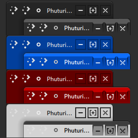

# phuturista-gamer-kde
---------------------

<i>Phuturista Gamer KDE</i>

# Description
Phuturista Gamer KDE is an elegant and dynamic desktop theme, meticulously crafted for those who perceive technology as art and virtual reality as a path to inspiration. Blending futuristic aesthetics with a gaming atmosphere, this theme is a perfect choice for individuals aspiring for interface excellence on their desktop.

Inspired by the limitless possibilities of virtual realms and cutting-edge technologies, Phuturista Gamer KDE offers a customizable experience that allows each user to immerse themselves in the heart of contemporary digital progress. The harmonious fusion of bold geometric forms, illuminating effects, and gaming-inspired details creates an ambiance as if you are encapsulated within the essence of virtual reality itself.

Phuturista Gamer KDE provides a plethora of customization options, granting every user the means to express their individuality. From understated minimalism to vibrant graphics, this theme affords you the freedom of choice. Moreover, carefully designed controls and an intuitive layout ensure effortless access to all your essential applications and tasks.

Dive into the realm of Phuturista Gamer KDE and let your desktop become a window to the future, where the boundaries between virtual and tangible realities blur, and inspiration is omnipresent.

## How to install ?
---------------------

    git clone https://github.com/badcast/phuturista-gamer-kde.git

    cd phuturista-gamer-kde

    chmod +x install.sh

    ./install.sh

Set Themes on **systemsettings** in KDE!

Enjoy and Feel!
